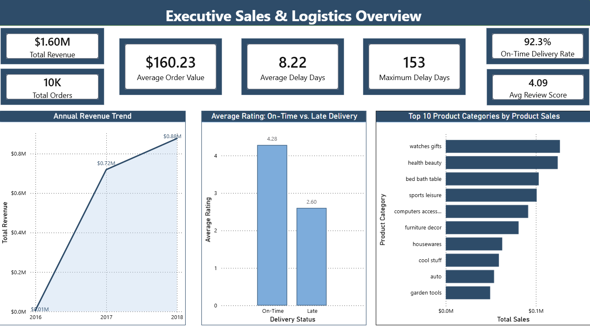
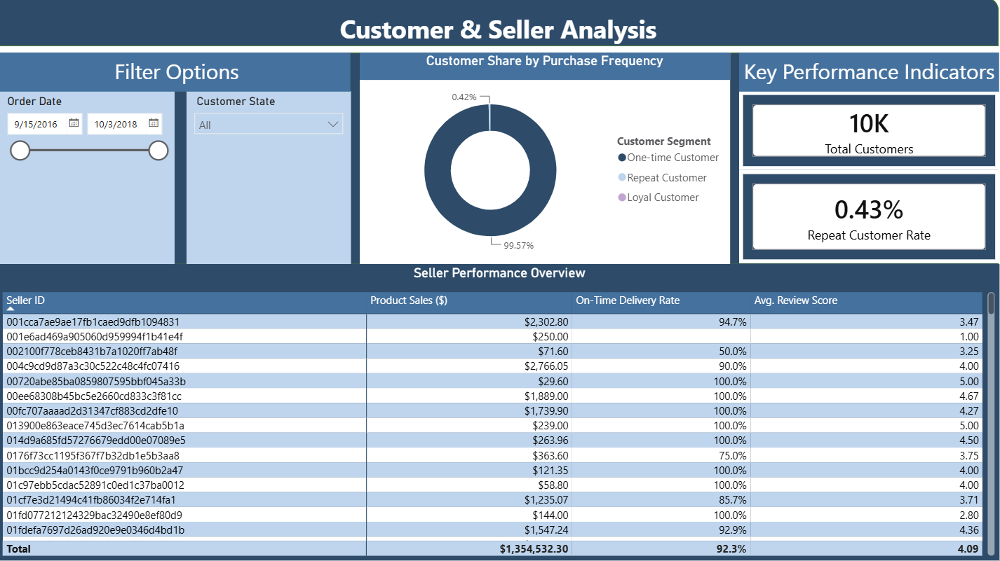

# Power BI Dashboard

This folder contains the Power BI dashboard developed for the Olist E-Commerce analysis project.

## Dashboard Pages

### 1. Executive Sales & Logistics Overview

Provides an executive-level overview of:

- Revenue
- Orders
- Average Order Value
- Delivery performance
- Customer review performance
- Revenue trends
- Product category sales

### 2. Customer & Seller Analysis

Provides deeper analysis of:

- Customer purchase frequency
- Repeat customer rate
- Seller performance
- Product sales
- On-time delivery rate
- Average review score

## Dashboard File

The Power BI dashboard is available in:

[Download Power BI Dashboard](./olist_ecommerce_dashboard.pbix)

Two dashboard screenshots are also provided for quick review:

- [Executive Sales & Logistics Overview](./dashboard_01_executive_overview.png)
- [Customer & Seller Analysis](./dashboard_02_customer_seller_analysis.png)

## Dashboard Preview

### 1. Executive Sales & Logistics Overview

### 2. Customer & Seller Analysis

## Key KPIs

- Total Revenue: $1.60M
- Total Orders: 10,000
- Average Order Value: $160.23
- On-Time Delivery Rate: 92.3%
- Average Review Score: 4.09
- Average Delivery Delay: 8.22 days
- Maximum Delivery Delay: 153 days
